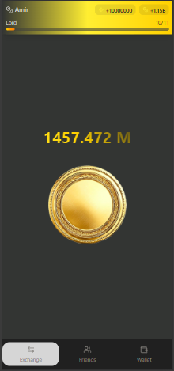

# CoinClicker

### 📋 Menu

- [About](#-about)
- [Features](#-features)
- [Tech Stack](#️-tech-stack)
- [Getting Started](#-getting-started)
- [Contributing](#-contributing)
- [Todo List](#-todo-list)
- [License](#-license)
- [Acknowledgements](#-acknowledgements)

### 📜 About

CoinClicker is an addictive idle clicker game inspired by popular titles like NotCoin and Hamster Combat. Click your way to riches in this shiny, golden adventure!

### 🚀 Features

- 💰 Earn coins by clicking
- 🆙 Level up and increase your earnings
- 👥 Compete with friends
- 🎨 Sleek, modern UI

### 🛠️ Tech Stack

- ⚛️ React
- ⚡ Vite
- 🌬️ Tailwind CSS

### 🏁 Getting Started

1. Clone the repository
2. Install dependencies with `npm install`
3. Run the development server with `npm run dev`
4. Start clicking and earning!

### 🤝 Contributing

We welcome contributions from the community! 

### 📋 Todo List

- **Feature Enhancements**
  - Add achievements and badges
  - Implement offline earning
  - Introduce new coin types and power-ups

- **UI Improvements**
  - Add animations to the clicking effect
  - Improve the user interface for the wallet section
  - Create a more interactive tutorial for new users

- **Performance Optimization**
  - Optimize the loading speed of the game
  - Reduce the size of the assets

- **Bug Fixes**
  - Fix the issue with the coin counter not updating in real-time
  - Resolve login/logout issues on the mobile version

### 📄 License

This project is licensed under the MIT License - see the [LICENSE](LICENSE) file for details.

### 🙏 Acknowledgements
- Built with ❤

Happy clicking! 🐹💰
